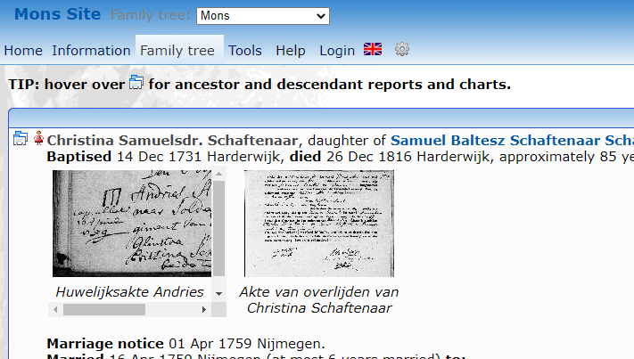

HuMo-genealogy is free genealogy software designed to help you publish and maintain a family tree on your own website.

It was created to give people full control over their genealogical data, while keeping the result simple to share with relatives and visitors.

## Why use HuMo-genealogy?

- Free and open-source genealogy software
- Works well with GEDCOM imports from other genealogy programs
- Lets you build a family website with your own layout and content
- Gives you control over visibility and user access
- Supports multiple languages and optional picture, source and place information

## Main features

- Import GEDCOM files from major genealogy programs
- Show persons, families, marriages, and sources
- Support for living person filtering and privacy controls
- Multiple languages, including Dutch, English and German
- Customizable website layout through themes and CSS
- Optional image and media support

## Typical workflow

1. Export your family data from a genealogy program as GEDCOM.
2. Import the GEDCOM file into HuMo-genealogy.
3. Review the family tree and adjust settings.
4. Publish the tree on your own website.

## Project links

- [Official project site](https://huubmons.github.io/HuMo-genealogy/)

- [Demo](https://humo-gen.com/wp/humo-genealogy-demo/)
  The demo is offline at the moment.

- [Download](https://github.com/HuubMons/HuMo-genealogy)

- [Manual](https://sourceforge.net/projects/humo-gen/files/HuMo-gen_Manual/)

- [GitHub repository](https://github.com/HuubMons/HuMo-genealogy)

- [Official project site](https://humo-gen.com/wp/)
- [Forum](https://humo-gen.com/genforum2)

## About me

I started this program in 1999, because I didn’t like the HTML output of the existing programs. I also had some problems with missing professions and texts.

HuMo-genealogy is developed since December 1999 (first in Quick Basic, and Delphi), and since juli 2005 available as opensource PHP version. Several users are now active in developing HuMo-genealogy!